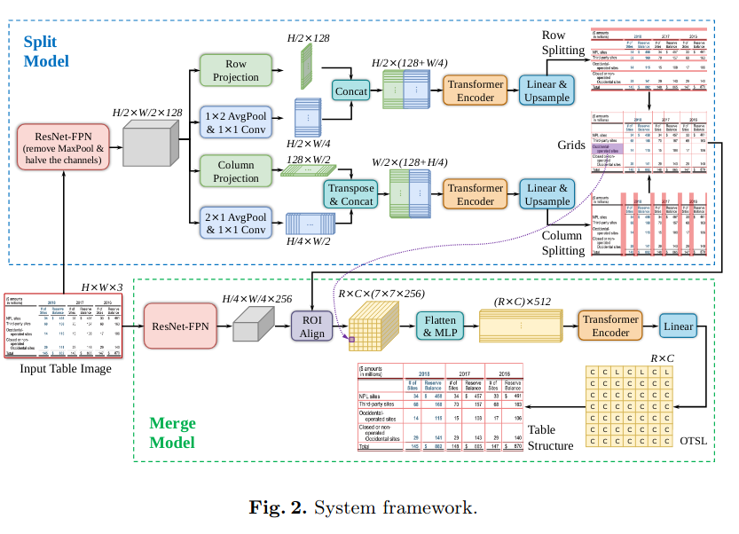
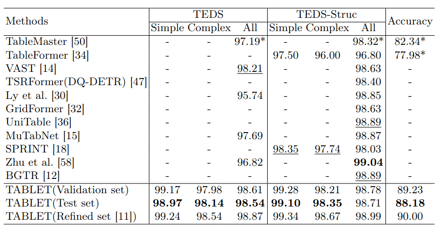
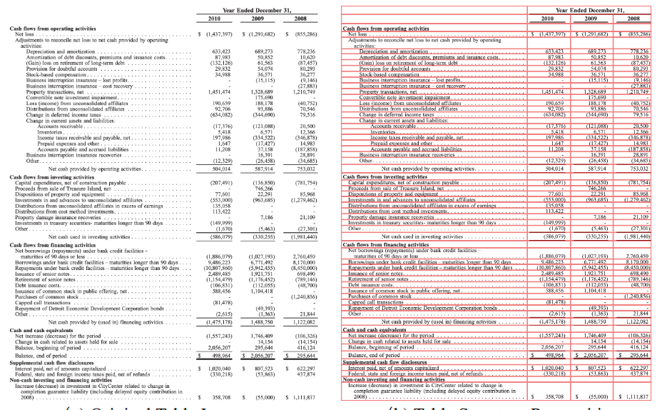
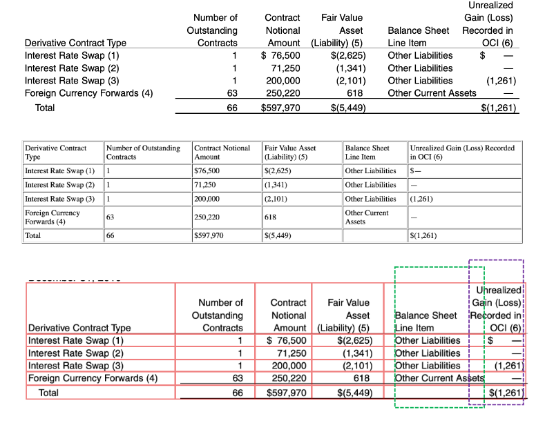
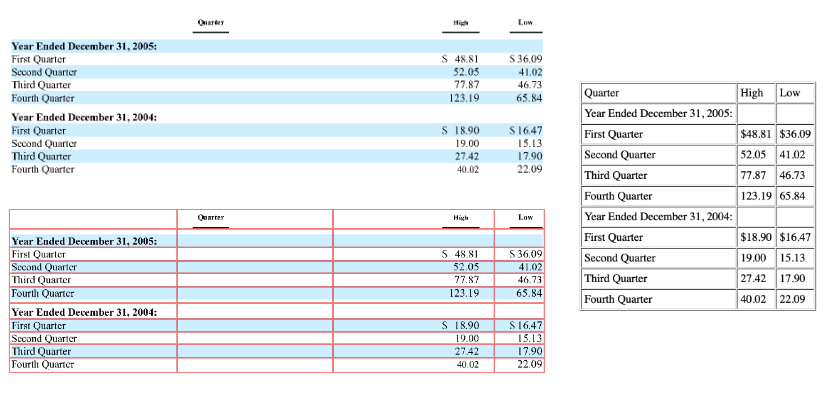
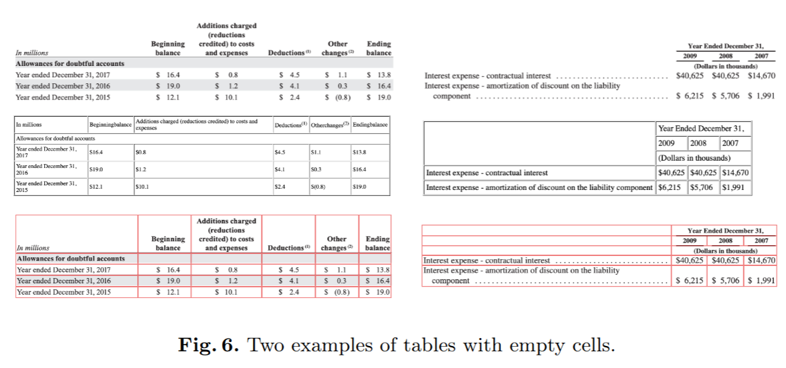

OTSL_PAPER: https://arxiv.org/pdf/2305.03393
> optimised table-structure language (OTSL) with a
    minimized vocabulary and specific rules. The benefits of OTSL are that
    it reduces the number of tokens to 5 (HTML needs 28+) and shortens
    the sequence length to half of HTML on average. Consequently, model
    accuracy improves significantly, inference time is halved compared to
    HTML-based models, and the predicted table structures are always syn-
    tactically correct. 

TABLET Paper: https://arxiv.org/pdf/2506.07015v1

Dataset: ds4sd/PubTabNet_OTSL
 * Search for More OTSL format dataset.

 Metrics:
 https://github.com/ibm-aur-nlp/PubTabNet/tree/master/src
 or mentioned ones in OTSL_PAPER

 

 For reference: https://github.com/JiaquanYe/TableMASTER-mmocr

 

 An example of a recognition error caused by the overlap of text regions between adjacent columns.

 

 An example of a column header completely misaligned with its corresponding
content below it.

 

 

